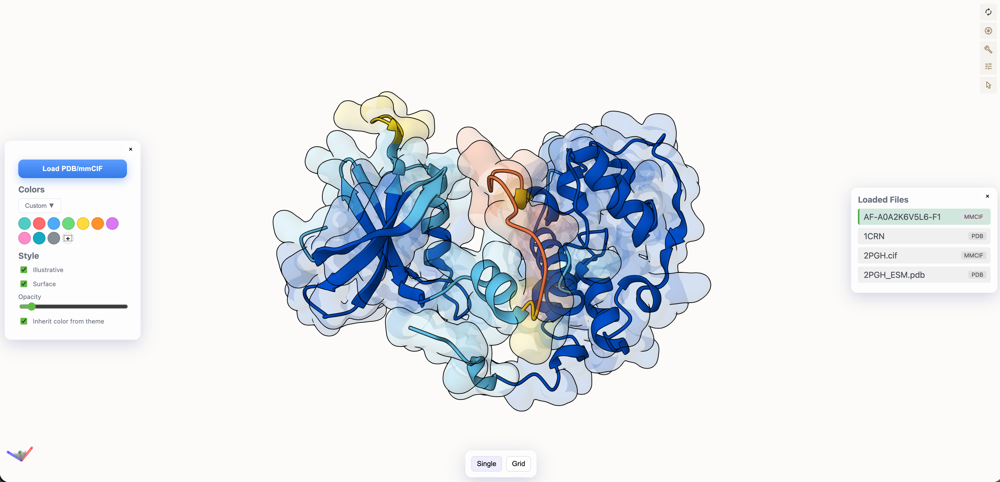
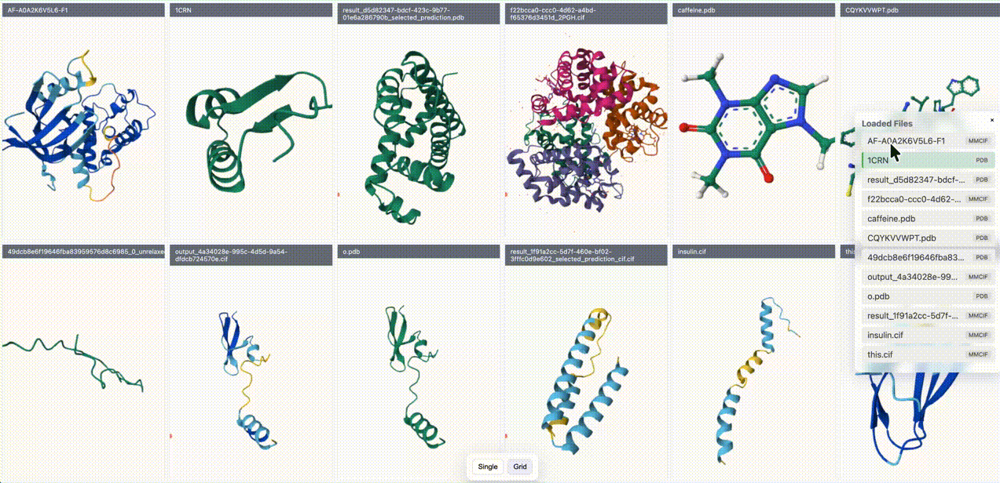

```
█▄░█ ▄▀█ █▄░█ █▀█   █▀█ █▀█ █▀█ ▀█▀ █▀▀ █ █▄░█   █▀█ █▀▀ ▄▀█ █▀▀ ▀█▀
█░▀█ █▀█ █░▀█ █▄█   █▀▀ █▀▄ █▄█ ░█░ ██▄ █ █░▀█   █▀▄ ██▄ █▀█ █▄▄ ░█░
```
  <p align="center">
  <a href="https://www.npmjs.com/package/@juliocesar-io/nano-protein-viewer-react"></a>
  <a href="https://github.com/juliocesar-io/nano-protein-viewer-react/actions/workflows/coverage.yml"></a>
  <a href="https://coveralls.io/github/juliocesar-io/nano-protein-viewer-react"></a>
  </p>




## Overview

A lightweight, extensible React implementation of the **Nano Protein Viewer**, originally developed as a VSCode extension by [**Steven Yu**](https://marketplace.visualstudio.com/items?itemName=StevenYu.nano-protein-viewer).  
 
This project brings the Mol\*-powered molecular visualization experience to the web enabling integration into any React or Next.js application.


## Install

```bash
pnpm install @juliocesar-io/nano-protein-viewer-react
```

Run tests

```bash
pnpm test
```

## Use in your app

```tsx
import { NanoProteinViewer, type StructureUrl } from '@juliocesar-io/nano-protein-viewer-react';

const structures: StructureUrl[] = [
  { name: '1CRN', url: 'https://files.rcsb.org/download/1CRN.pdb', format: 'pdb' }
];

export default function App() {
  return (
    <div style={{ width: '100%', height: '100vh' }}>
      <NanoProteinViewer structureUrls={structures} />
    </div>
  );
```

## Local deveploment


Run the example react_app locally:

```bash
cd react_app
pnpm install
pnpm dev
```

Go to:  http://localhost:5173




## Design Rationale

This React app:

- Decouples the viewer logic into reusable components
- Enables embedding in research dashboards, notebooks, or web portals
- Provides a base to extend features (grid view, color themes, External API integration) gradually
- Allows server-side frameworks (Next.js, Remix, Vite) to integrate molecular viewers easily

## License & Attribution

This project is released under the MIT License.

Adapted and inspired by the [Nano Protein Viewer VSCode Extension](https://github.com/54yyyu/nano-protein-viewer) by Steven Yu.

Mol* framework © Mol* team – see citation below.

## Citation

If you use this viewer or the underlying Mol* visualization engine in academic work:

```
@article{sehnal2021molstar,
  author = {Sehnal, David and Bittrich, Sebastian and Deshpande, Mandar and Svobodová, Radka and Berka, Karel and Bazgier, Václav and Velankar, Sameer and Burley, Stephen K and Koča, Jaroslav and Rose, Alexander S},
  title = "{Mol* Viewer: modern web app for 3D visualization and analysis of large biomolecular structures}",
  journal = {Nucleic Acids Research},
  volume = {49},
  number = {W1},
  pages = {W431-W437},
  year = {2021},
  doi = {10.1093/nar/gkab314}
}
```

## Contributing

Contributions are welcome!
If you’ve added a visualization mode, folding integration, or UI control, please open a PR.

The roadmap includes:
- APIs integration for folding
- Structure alignment
- Animation playback
- Alphafold DB/ RCSB PDB search import